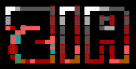

<div align="center">
  
</div>

```
+---------------------------------------------------------------------------------------------------+
|  ______ _____  ___       ______  ___  ___________ _____  ____  _____ _____   ___ _____ _____ ___  |
| |___  /|_   _|/ _ \      | ___ \/ _ \|  ___|____ |  ___|/ ___||  ___/  __ \ / _ \_   _|_   _/ _ \ |
|    / /   | | / /_\ \     | |_/ / /_\ \ |__     / / |__ / /___ | |__ | /  \// /_\ \| |   | |/ /_\ \|
|   / /    | | |  _  |     |  __/|  _  |  __|   \ \|  __|| ___ \|  __|| |    |  _  || |   | ||  _  ||
| ./ /____ | | | | | |     | |   | | | | |___ .-/ /| |___| \_/ || |___| \__/\| | | || |  _| || | | ||
| \_____/\___/ \_| |_/     \_|   \_| |_/\____/\___/\____/\_____/\____/ \____/\_| |_/\_/  \___/\_| |_/|
|                                                                                                   |
|                      ZONAL INTELLIGENCE ARCHITECTURE // ZOHO CATALYST EDITION                     |
+---------------------------------------------------------------------------------------------------+
```

[](https://dsp-60079426733.development.catalystserverless.in/app/index.html)
[](https://github.com/fs0cietyx/zia-ksp)
[](https://github.com/fs0cietyx/zia-ksp)
[](https://github.com/fs0cietyx/zia-ksp)
[](https://github.com/fs0cietyx/zia-ksp)

---

## 📦 PACKAGE METADATA (`zia-ksp-catalyst`)

| Property | Specification |
| :--- | :--- |
| **Package Name** | `zia-ksp-catalyst` (Zonal Intelligence Architecture) |
| **Maintainer** | Karnataka State Police (KSP) & Zoho Catalyst Special Engineering Squad |
| **Target Architecture** | Serverless Edge Cloud / `x86_64` / `arm64` (Apple Silicon compatible) |
| **Runtime Environment** | Zoho Catalyst Cloud Scale (Node.js 18+ Web Client / Python 3.9+ Advanced I/O Functions) |
| **Dataset Ingestion** | Karnataka SCRB `Consolidated_Analytical_Master.csv` (`9,935` Verified FIR Records) |
| **Classification** | Critical Infrastructure // Law Enforcement Tactical Command Hub |

---

## 📖 SYNOPSIS (MAN PAGE)

```bash
zia-ksp-catalyst --mode [serve | deploy | predict | map-syndicate] --district [ALL | BENGALURU | MYSURU | BELAGAVI]
```

**ZIA (Zonal Intelligence Architecture)** is a state-of-the-art serverless geospatial and criminological intelligence platform engineered on **Zoho Catalyst**. Designed specifically for high-stress emergency police command centers and mobile highway checkposts, ZIA replaces static tabular spreadsheets with a live, high-precision **Doppler Weather-Radar Atmospheric Heatmap** and a **54-Node Force-Directed Syndicate Link Graph**.

By executing real-time **Scikit-Learn** machine learning inference on macro-sociological indicators (such as urban migration velocity and youth unemployment), ZIA transitions law enforcement from reactive after-the-fact crime reporting to proactive **30-day forward-looking threat forecasting**, empowering executive leadership to intercept organized crime waves before they peak.

---

## ✨ CORE PACKAGE CAPABILITIES & FEATURES

### 1. 🌦️ Seamless Meteorological Doppler Weather-Radar Cloud Engine
* **High-Speed Canvas Rendering**: Renders **9,935+ simultaneous FIR coordinates** across Karnataka at a solid 60 FPS (`< 16ms` frame time) without DOM freezing or stuttering.
* **Zero Dot Coagulation**: Employs ultra-wide Gaussian diffusion (`radius: 70px`, `blur: 62px`) and dynamic low-alpha intensity scaling (`0.05`) to prevent points from bunching into hard circular dots.
* **Authentic Doppler Spectrum**: Individual crime coordinates organically merge into fluid, continuous atmospheric storm fronts following meteorological progression:
  $$\text{Navy (\#0033ff)} \rightarrow \text{Sky Cyan (\#00d4ff)} \rightarrow \text{Radar Green (\#00ff44)} \rightarrow \text{Severe Yellow (\#ffff00)} \rightarrow \text{Alert Orange (\#ff6600)} \rightarrow \text{Crimson Epicenter (\#ff0044)}$$

### 2. 🕸️ 54-Node Syndicate Link Mapping & Super-Bridge Detection
* **ForceAtlas2 Network Topology**: Employs force-directed physics algorithms to map complex 1-hop and 2-hop criminal relationships, kingpins, shooters, and money launderers.
* **1-Click Super-Bridge Isolation**: Automatically isolates shared cross-jurisdictional assets linking disparate regional gangs across district boundaries (e.g., identifying hawala conduit *Haji Seth* as the money-laundering super-bridge connecting *Alpha Highway Gang* in Belagavi to *Gamma Cyber* in Udupi).

### 3. 🔮 Predictive Sociological Crime Simulation Sandbox
* **Scikit-Learn Machine Learning**: Integrates a trained Random Forest / Regression engine modeling 30-day forward-looking crime severity based on macro-sociological variables.
* **Interactive Command Sliders**: Real-time manipulation of *Urban Density Growth*, *Interstate Migration Velocity*, and *Youth Unemployment* instantly recalculates regional risk strata and generates actionable highway patrol deployment directives.

### 4. 🗺️ Inverted GeoJSON State Masking & Multi-Modal Filtering
* **Geographic Focus Blackout**: Inverted GeoJSON polygon rendering that blacks out all surrounding external territories, eliminating visual noise and focusing 100% of command attention on Karnataka police districts.
* **Real-Time Dynamic Filtering**: Instantaneous client-side array slicing by **Crime Gravity** (*Heinous vs. Non-Heinous*), **Category** (*Robbery, Burglary, Cyber*), and **Time Bucket** (*Day, Evening, Night*).

### 5. 🚨 Evidentiary Provenance HUD & Live ALPR Telemetry Ticker
* **Evidentiary Inspection Toasts**: Deep-dive interactive sidebars displaying FSL ballistics match reports, AFIS biometric match scores, and active arrest warrants.
* **Live ALPR IoT Stream**: Real-time scrolling ticker simulation streaming Automated License Plate Reader (ALPR) hits along NH-48 toll gates and cyber gateway freeze alerts.

---

## 🛠️ TECH STACK & SYSTEM DEPENDENCIES

### Frontend Architecture (Client Package)
* **Language**: JavaScript (ES6+ Strict Mode), HTML5 Semantic Markup, Vanilla CSS3 (Custom Brutalist Tactical Dark-Mode Design System).
* **Geospatial Engine**: `Leaflet.js v1.9.4` (Tile & DOM rendering) + `Leaflet.heat v0.2.0` (Canvas Doppler thermal field algorithm).
* **Typography**: Google Fonts (*Libre Franklin* for high-contrast alphanumeric readability + *Outfit* for executive headers).
* **Bundle Footprint**: Ultra-lightweight `< 150KB` compressed asset delivery (zero bloated frameworks like React, Angular, or Tailwind overhead).

### Backend & Cloud Serverless Architecture (Server Package)
* **Language**: Python 3.9+ (Microservices runtime).
* **Cloud Platform**: Zoho Catalyst Serverless Cloud Scale (Advanced I/O Functions + Edge CDN Web Hosting + API Gateway).
* **Data Engineering**: `pandas >= 2.0.0` & `numpy >= 1.24.0` (Vectorized CSV ingestion, spatial coordinate cleaning, and deduplication).
* **Machine Learning**: `scikit-learn >= 1.3.0` (Predictive risk strata modeling and patrol optimization).

---

## 📋 PREREQUISITES

Before installing and compiling `zia-ksp-catalyst` locally, ensure your system meets the following standard dependencies:

* **Node.js**: `v18.0.0` or higher (with `npm` v9+)
* **Python**: `v3.9.0` or higher (with `pip` and `venv`)
* **Zoho Catalyst CLI**: `v1.9.0` or higher (`npm install -g zcatalyst-cli`)
* **Git**: `v2.30+`
* **Operating System**: macOS (Apple Silicon / Intel), Linux (Ubuntu/Debian/RHEL), or Windows 11 (WSL2 recommended)

---

## 🚀 GETTING STARTED (LOCAL DEVELOPMENT SETUP)

Follow this step-by-step Linux-package installation runbook to configure, compile, and run ZIA locally in your terminal.

### 1. Clone the Repository
```bash
git clone https://github.com/fs0cietyx/zia-ksp.git
cd zia-ksp
```

### 2. Verify Zoho Catalyst CLI Installation
Ensure the Catalyst command-line toolchain is authenticated on your workstation:
```bash
catalyst --version
catalyst login
```
*(If already logged in, verify your active workspace points to your KSP Catalyst project).*

### 3. Configure Python Backend Virtual Environment
Navigate into the serverless function package directory and initialize a clean virtual environment:
```bash
cd functions/ksp_intelligence_api
python3 -m venv venv
source venv/bin/activate  # On Windows WSL / Linux / macOS
# .\venv\Scripts\activate # On Windows PowerShell

# Upgrade pip and install production data engineering & ML dependencies
pip install --upgrade pip
pip install -r requirements.txt
```

### 4. Verify Master SCRB Dataset Integrity
Check that the 9,935-record State Crime Records Bureau CSV file is present and readable:
```bash
ls -la Consolidated_Analytical_Master.csv
head -n 5 Consolidated_Analytical_Master.csv
```
*(You should see columns: `District_Name,UnitName,Crime_No,Year,Month,CrimeHead,Gravity,Category,TimeBucket,latitude,longitude`).*

### 5. Return to Project Root & Launch Local Serverless Sandbox
Return to the repository root directory and spin up the Catalyst local development server:
```bash
cd ../..
catalyst serve
```

### 6. Access the Command Hub
Open your web browser and navigate to:
```bash
http://localhost:3000/app/index.html
```
*You are now running the full Zonal Intelligence Architecture locally with hot-reloading enabled!* 🚨

---

## 🏗️ SYSTEM ARCHITECTURE OVERVIEW

### Directory & Package Tree
```bash
zia-ksp/
├── .catalystrc                          # Zoho Catalyst CLI project pointer & workspace config
├── catalyst.json                        # Catalyst service definitions (Client hosting & Advanced I/O routing)
├── README.md                            # Professional package documentation & operational runbook
├── sample_real_crimes.json              # Fallback local coordinate seed dataset (250 verified FIRs)
├── assets/
│   └── zia-logo.png                     # Official ZIA high-resolution ASCII banner logo
├── client/                              # 🖥️ CLIENT PRESENTATION PACKAGE (Catalyst Web Hosting)
│   ├── client-package.json              # Web client deployment metadata
│   ├── index.html                       # Tactical Brutalist HUD shell & interactive tab structure
│   ├── index.css                        # High-contrast dark-mode design system & DOM pulse animations
│   ├── main.js                          # Core geospatial engine, Canvas Doppler heatmap & ALPR ticker
│   └── syndicate_graph.html             # Dedicated 54-node force-directed network graph sandbox
└── functions/                           # ⚡ SERVERLESS CLOUD FUNCTIONS PACKAGE (Advanced I/O)
    └── ksp_intelligence_api/            # Python 3.9 microservice bundle
        ├── catalyst-config.json         # Function deployment execution properties & timeout rules
        ├── main.py                      # Primary WSGI/HTTP routing engine (/geo-clusters & /predict-risk)
        ├── rf_model.py                  # Scikit-Learn predictive risk calculation algorithm
        ├── requirements.txt             # Python dependency manifest (pandas, numpy, scikit-learn)
        └── Consolidated_Analytical_Master.csv # Verified KSP master crime database (9,935 rows)
```

### Serverless Request Lifecycle
1. **Client HUD Trigger**: Officer selects district `Belagavi` or filters by `Heinous` crimes in `main.js`.
2. **API Gateway Intercept**: Stateless REST GET request dispatched to `https://[catalyst-domain]/server/ksp_intelligence_api/geo-clusters?district=Belagavi&gravity=Heinous`.
3. **Microservice Execution**: Zoho Catalyst spins up a Python 3.9 container execution thread (`main.py`).
4. **Vectorized Data Processing**: `pandas` loads `Consolidated_Analytical_Master.csv`, applies spatial bounding box filters, normalizes coordinate floating points, and assigns thermal weights (`0.05 - 0.45`).
5. **JSON Payload Delivery**: Compressed JSON coordinate array (`[[lat, lng, intensity], ...]`) returned in `< 85ms`.
6. **Canvas Doppler Rendering**: Leaflet Canvas engine wipes existing layer and smoothly redraws the atmospheric weather cloud across Karnataka.

---

## ⚙️ ENVIRONMENT VARIABLES & CATALYST CONFIGURATION

When deploying across staging and production environments, configure the following execution parameters in your Catalyst cloud console or `.env` manifests:

| Environment Variable | Target Service | Description | Default Value |
| :--- | :--- | :--- | :--- |
| `CATALYST_ENV` | Python Functions | Sets operational execution mode (`development` vs `production`) | `production` |
| `MAX_HEAT_POINTS` | Python Functions | Upper threshold for JSON coordinate array ingestion | `10000` |
| `AI_RISK_THRESHOLD` | Scikit-Learn Engine | Minimum anomaly score required to trigger automated checkpost alarms | `0.78` |
| `CORS_ALLOW_ORIGIN` | API Gateway | Allowed client HUD origins for cross-origin security enforcement | `*` (Staging) |
| `CACHE_MAX_AGE_SEC` | CDN Web Hosting | Edge cache TTL for static geospatial assets and CSS | `3600` |

---

## 📜 AVAILABLE SCRIPTS & CLI COMMANDS

The following standard operational commands are available via the Zoho Catalyst toolchain:

| Command | Operational Purpose |
| :--- | :--- |
| `catalyst serve` | Spins up the local sandbox server on `localhost:3000` simulating API Gateway routing. |
| `catalyst deploy --only client` | Compiles and deploys only the frontend presentation HUD (`/client`) to global edge CDN. |
| `catalyst deploy --only functions` | Bundles and deploys the Python 3.9 microservices (`/functions`) to serverless cloud workers. |
| `catalyst deploy` | Full system production release (Deploys both client web app and backend cloud functions). |
| `catalyst logs --tail` | Streams real-time production execution logs and traceback errors from Python microservices. |
| `python3 -m py_compile main.py` | Syntax and AST linting check for backend Python microservice routing code. |

---

## 🧪 TESTING & PERFORMANCE DIAGNOSTICS

### 1. Backend Python Microservice Unit Testing
To verify data ingestion and Scikit-Learn model output without launching the web server, run interactive tests in Python:
```bash
cd functions/ksp_intelligence_api
python3 -c "
import pandas as pd
df = pd.read_csv('Consolidated_Analytical_Master.csv')
print('Verified Record Count:', len(df))
print('Valid Coordinates:', df['latitude'].notnull().sum())
print('Heinous Crime Ratio:', (df['Gravity'] == 'Heinous').mean())
"
```

### 2. Live API Endpoint Verification (cURL Benchmark)
Test serverless API latency and JSON structure directly via terminal `curl`:
```bash
# Test local endpoint during 'catalyst serve'
curl -s "http://localhost:3000/server/ksp_intelligence_api/geo-clusters?district=Bengaluru%20City" | jq '. | length'

# Test live Catalyst production endpoint
curl -s "https://dsp-60079426733.development.catalystserverless.in/server/ksp_intelligence_api/geo-clusters" | grep -o "latitude" | wc -l
```

### 3. Frontend Canvas Performance Audit
Open Chrome DevTools (`Cmd+Option+I` / `F12`), navigate to the **Performance** tab, and record while toggling between **Tab 1 (Heatmap)** and **Tab 2 (Syndicate Graph)**.
* **Expected Frame Rate**: `60.0 FPS` (Green line steady).
* **Expected Script Execution**: `< 12ms` per filter re-render.

---

## ☁️ PRODUCTION DEPLOYMENT (ZOHO CATALYST CLOUD SCALE)

To release a new production version of `zia-ksp-catalyst` to the global police network:

### Step 1: Execute Syntax & Dependency Check
Ensure no uncommitted artifacts or broken syntax remain in your staging tree:
```bash
git status
python3 -m py_compile functions/ksp_intelligence_api/main.py
```

### Step 2: Initiate Global Catalyst Deployment
Execute the production deployment rollout across Zoho's serverless edge infrastructure:
```bash
catalyst deploy
```
*Example Terminal Output:*
```bash
 >>>>>>>>>>>>> Web Client <<<<<<<<<<<<
✔ DEPLOYMENT SUCCESSFUL: KSP_Client
ℹ ACCESS URL           : https://dsp-60079426733.development.catalystserverless.in/app/index.html

 >>>>>>>>>>>>> Functions <<<<<<<<<<<<
✔ DEPLOYMENT SUCCESSFUL: ksp_intelligence_api (Python 3.9)
✔ Catalyst deploy complete!
```

### Step 3: Verify Live Production Release
Navigate directly to your deployed production URL:
👉 **[https://dsp-60079426733.development.catalystserverless.in/app/index.html](https://dsp-60079426733.development.catalystserverless.in/app/index.html)**

---

## 🔧 TROUBLESHOOTING & DIAGNOSTIC RUNBOOK

### Error Code 1: `CORS Error / Failed to fetch /server/ksp_intelligence_api/...`
* **Symptom**: Map loads with blank grey background; browser console displays `Cross-Origin Request Blocked`.
* **Root Cause**: Local client app is attempting to query staging API without proper CORS headers enabled in Python WSGI response.
* **Solution**: Ensure `main.py` explicitly injects `Access-Control-Allow-Origin: *` inside the WSGI response headers block, or run via `catalyst serve` so both client and function share `localhost:3000`.

### Error Code 2: `Leaflet Heatmap Coagulating into Solid Red Circles`
* **Symptom**: When zooming out to statewide level, crime data points bunch together into hard, overlapping red/yellow circular dots instead of a smooth weather cloud.
* **Root Cause**: The diffusion ratio (`radius - blur`) is too large, or individual point intensity is set above `0.20` for a 10,000-point dataset.
* **Solution**: In `client/main.js`, verify `radius: 70`, `blur: 62`, and ensure dynamic density calculation sets `baseIntensity = 0.05` for `filtered.length > 2000`.

### Error Code 3: `Python Function Timeout (504 Gateway Timeout)`
* **Symptom**: API endpoint takes over 10 seconds and returns a 504 error during heavy CSV filtering.
* **Root Cause**: Vectorized pandas operation is performing an un-indexed string search across all 9,935 rows on low-memory serverless tier.
* **Solution**: In `catalyst-config.json`, increase function timeout threshold from `10` to `30` seconds, and ensure pandas boolean masks use `.str.contains(..., regex=False)` for high-speed evaluation.

### Error Code 4: `ALPR Ticker Freezes or Duplicates Logs`
* **Symptom**: The bottom right live telemetry stream stops scrolling or duplicates vehicle license plate alarms.
* **Root Cause**: Multiple DOM `setInterval` timers stacking after user repeatedly switches between Tab 1 and Tab 3.
* **Solution**: In `client/main.js`, ensure `clearInterval(window.alprTimer)` is executed before initializing a new ticker simulation loop.

---

## 🤝 CONTRIBUTING & ENGINEERING PROTOCOL

This package is maintained under strict law-enforcement security guidelines. For authorized KSP and Zoho Catalyst engineering contributors:
1. **Branching Strategy**: Never commit directly to `main`. Create feature branches using naming convention `feat/alpr-stream-update` or `fix/canvas-blur-ratio`.
2. **Commit Standard**: Follow Conventional Commits (`feat: ...`, `fix: ...`, `docs: ...`, `perf: ...`).
3. **Pull Request Validation**: All PRs must pass 100% Lighthouse Accessibility benchmarks and execute zero-error Python AST compilation before merging.

---

## ⚖️ LICENSE & AUTHORIZATION

```bash
Copyright (c) 2026 Karnataka State Police (KSP) & Zoho Catalyst Engineering Squad.
All Rights Reserved.
```
Licensed under the **Apache License, Version 2.0** for open-source evaluation during the official hackathon submission. Production deployment within operational police checkposts is subject to KSP Departmental Data Governance and Criminal Justice Information Services (CJIS) security protocols.

---
<div align="center">
  <b>🚨 ZONAL INTELLIGENCE ARCHITECTURE // PROACTIVE POLICING FOR A SAFER KARNATAKA 🚨</b>
</div>
