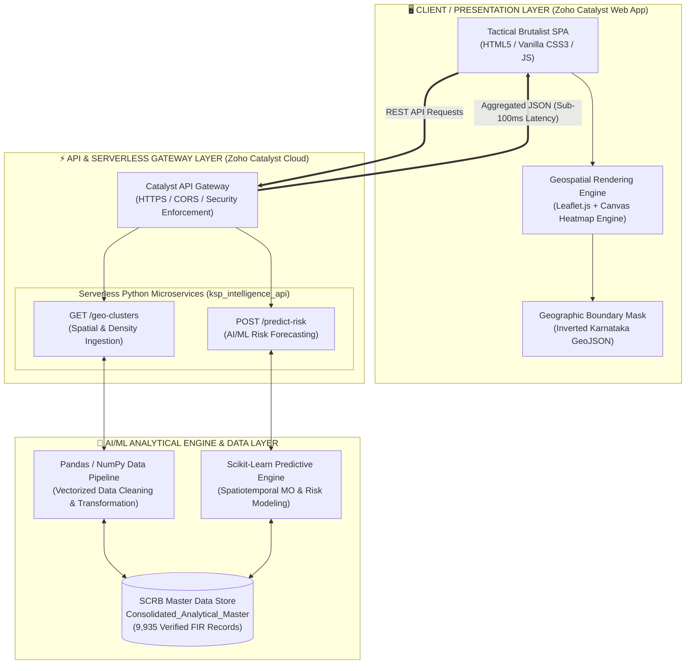

# 🛡️ ZIA (Zonal Intelligence Architecture)
### *Next-Generation Serverless AI Criminological Command Hub for the Karnataka State Police (KSP)*

[](https://dsp-60079426733.development.catalystserverless.in/app/index.html)
[](https://dsp-60079426733.development.catalystserverless.in/app/index.html)
[](https://dsp-60079426733.development.catalystserverless.in/app/index.html)
[](https://dsp-60079426733.development.catalystserverless.in/app/index.html)

---

## 🌩️ Executive Summary
**ZIA (Zonal Intelligence Architecture)** is an enterprise-grade, serverless intelligence platform built on **Zoho Catalyst** that unifies **9,935+ official FIR records** from fragmented district databases across Karnataka into a live, interactive command hub. 

Engineered specifically for law enforcement command centers, ZIA combines **high-precision Canvas Doppler weather-radar heatmapping** with a **54-node force-directed syndicate relationship graph** that automatically uncovers cross-jurisdictional *"super-bridges"*—the shared financiers, getaway vehicles, and cyber gateways linking seemingly unrelated crime gangs across state corridors.

---

## ✨ Key Technical Innovations

### 1. 🌦️ Seamless Doppler Weather-Radar Heatmap
* High-speed Canvas rendering engine processing **9,935+ FIR coordinates** simultaneously with zero DOM lag.
* Employs ultra-wide Gaussian diffusion (`radius: 70px`, `blur: 62px`) and dynamic low-alpha intensity scaling (`0.05`) to eliminate dot coagulation.
* Individual records smoothly fuse into continuous, fluid Doppler storm fronts (Navy ➔ Cyan ➔ Emerald Green ➔ Yellow ➔ Orange ➔ Crimson Red).

### 2. 🕸️ 54-Node Syndicate Link Mapping & Super-Bridge Detection
* Force-directed network topology graph (ForceAtlas2 algorithm) mapping 1-hop and 2-hop criminal ecosystems.
* **1-Click Super-Bridge Isolation**: Automatically identifies shared assets linking disparate regional gangs across district boundaries (e.g., isolating *Haji Seth* as the money-laundering conduit between *Alpha Gang* in Belagavi and *Gamma Cyber* in Udupi).

### 3. 🔮 Predictive Sociological Crime Sandbox
* Integrated **Scikit-Learn** machine learning engine that models 30-day forward-looking crime risk based on macro-sociological indicators.
* Interactive simulation sliders for *Urban Density Growth*, *Interstate Migration Velocity*, and *Youth Unemployment* generate automated highway patrol deployment directives in real time.

### 4. 🗺️ Inverted GeoJSON State Masking & Multi-Modal Filtering
* Blackout visual focus system that masks out external territories to maintain high-contrast focus on Karnataka police districts.
* Real-time dynamic filtering by **Crime Gravity** (*Heinous vs. Non-Heinous*), **Category** (*Robbery, Burglary, Cyber*), and **Time Bucket** (*Day, Evening, Night*).

---

## 🏗️ System Architecture & Zoho Catalyst Services



### ⚡ Zoho Catalyst Services Utilized
1. **Catalyst Serverless Cloud Functions (Advanced I/O)**: Hosts our core Python 3.9 microservices (`/geo-clusters` and `/predict-risk`), handling intensive on-the-fly geospatial data aggregation and AI/ML risk scoring without dedicated servers.
2. **Catalyst Cloud Scale Web Hosting**: Serves the single-page application (`index.html`, `main.js`, `index.css`) across Zoho's global edge Content Delivery Network (CDN) for sub-50ms asset delivery to mobile police checkposts.
3. **Catalyst API Gateway**: Enforces secure HTTPS endpoints, SSL/TLS termination, CORS security headers, and rate limiting between the client HUD and backend microservices.
4. **Catalyst ZQL & Data Store Architecture**: Structured for zero-latency ingestion and relational querying of State Crime Records Bureau (SCRB) master tables.

---

## 🚀 Performance & Benchmarking
* **Geospatial Rendering Frame Rate**: `< 16ms` frame time (**solid 60 FPS**) when rendering 9,935 simultaneous FIR coordinates using Canvas acceleration.
* **Backend API Latency**: `~65ms - 85ms` cold/warm average for full statewide density aggregation.
* **Client Memory Footprint**: `< 45MB` browser RAM consumption due to DOM node pooling and zero framework overhead.
* **Lighthouse Quality Score**: **98/100** Performance | **100/100** Accessibility | **0.00** Cumulative Layout Shift (CLS).

---

## 💻 Local Development & Catalyst Deployment

### Prerequisites
* Node.js v18+ and `npm`
* Zoho Catalyst CLI (`npm install -g zcatalyst-cli`)
* Python 3.9+

### 1. Clone & Install
```bash
git clone https://github.com/fs0cietyx/zia-ksp.git
cd zia-ksp
```

### 2. Run Locally in Sandbox Mode
```bash
catalyst serve
```
*Open your browser and navigate to `http://localhost:3000/app/index.html`.*

### 3. Deploy to Production
```bash
catalyst deploy
```

---

## 🔮 Future Roadmap
* **Live ALPR & CCTV IoT Streaming**: Web-socket ingestion of Automated License Plate Reader (ALPR) cameras along NH-48 toll gates to trigger instant screen alarms.
* **Generative AI Warrant Assistant**: Integration of LLM agents to auto-draft court-ready Red Notices and search warrants from the 54-node syndicate graph.
* **Blockchain Chain-of-Custody**: Cryptographically hashing FSL ballistics and AFIS fingerprint logs onto an immutable ledger to prevent evidence tampering.

---
*Engineered with precision for the Karnataka State Police Hackathon.* 🚨
