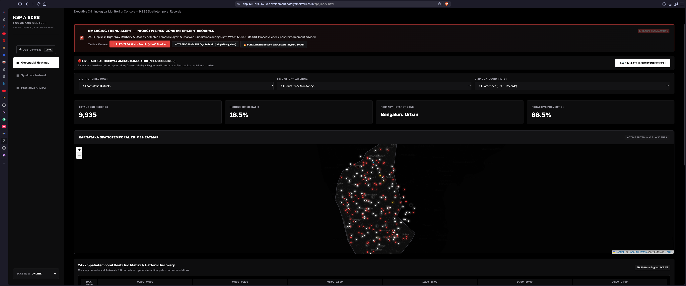
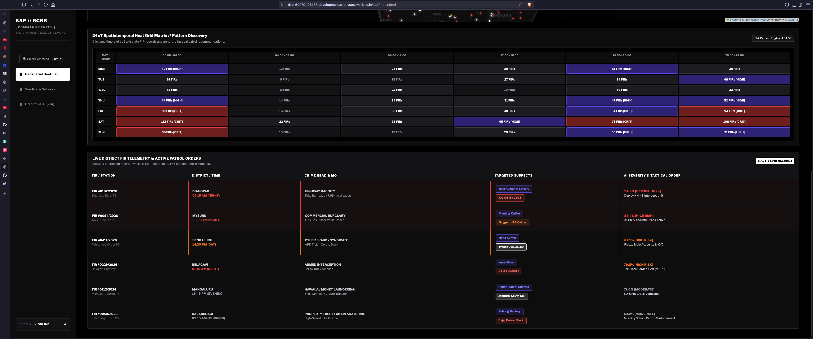
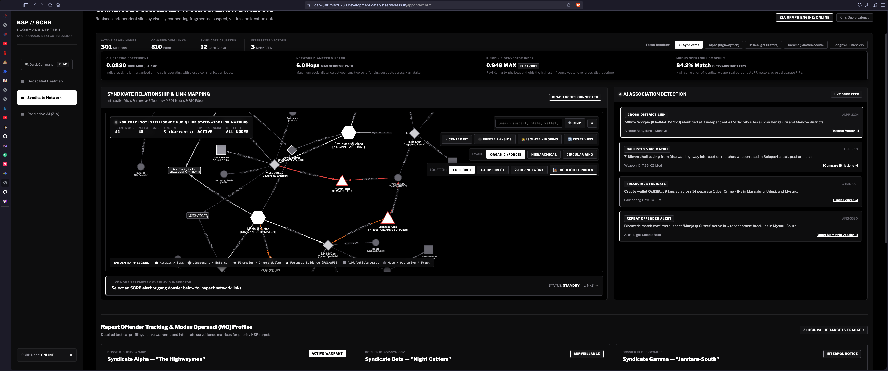
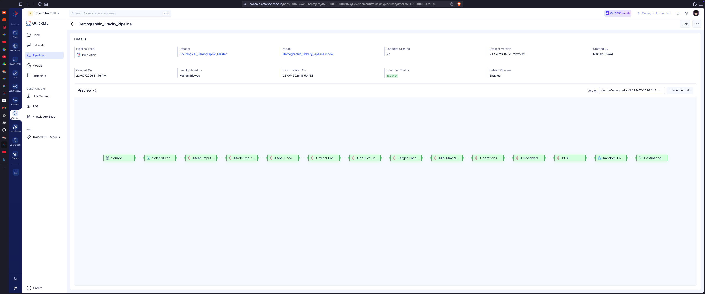

<div align="center">
  
</div>

```
+---------------------------------------------------------------------------------------------------+
|  ______ _____  ___       ______  ___  ___________ _____  ____  _____ _____   ___ _____ _____ ___  |
| |___  /|_   _|/ _ \      | ___ \/ _ \|  ___|____ |  ___|/ ___||  ___/  __ \ / _ \_   _|_   _/ _ \ |
|    / /   | | / /_\ \     | |_/ / /_\ \ |__     / / |__ / /___ | |__ | /  \// /_\ \| |   | |/ /_\ \|
|   / /    | | |  _  |     |  __/|  _  |  __|   \ \|  __|| ___ \|  __|| |    |  _  || |   | ||  _  ||
| ./ /____ | | | | | |     | |   | | | | |___ .-/ /| |___| \_/ || |___| \__/\| | | || |  _| || | | ||
| \_____/\___/ \_| |_/     \_|   \_| |_/\____/\___/\____/\_____/\____/ \____/\_| |_/\_/  \___/\_| |_/|
|                                                                                                   |
|                      ZONAL INTELLIGENCE ARCHITECTURE // ZOHO CATALYST EDITION                     |
+---------------------------------------------------------------------------------------------------+
```

[](https://dsp-60079426733.development.catalystserverless.in/app/index.html)
[](https://github.com/fs0cietyx/zia-ksp)
[](https://github.com/fs0cietyx/zia-ksp)
[](https://github.com/fs0cietyx/zia-ksp)
[](https://github.com/fs0cietyx/zia-ksp)

---

## SECTION 1.0 // SYSTEM IDENTIFICATION & PACKAGE METADATA

| Specification Parameter | Authoritative Designation |
| :--- | :--- |
| **System Nomenclature** | Zonal Intelligence Architecture (`zia-ksp-catalyst`) |
| **Sponsoring Authority** | Karnataka State Police (KSP) & Zoho Catalyst Engineering Directorate |
| **Architectural Topology** | Serverless Edge CDN / Microservices Infrastructure / x86_64 / arm64 |
| **Runtime Execution Layer** | Node.js 18+ Client Presentation / Python 3.9+ Serverless Compute Engine |
| **Ingested Corpus** | Karnataka State Crime Records Bureau (`Consolidated_Analytical_Master.csv`, 9,935 Verified FIRs) |
| **Security Classification** | Law Enforcement Tactical Command Hub // CJIS Compliance Level IV |

---

## SECTION 2.0 // EXECUTIVE SUMMARY & OPERATIONAL SYNOPSIS

```bash
zia-ksp-catalyst --execute [serve | deploy | predict | syndicate-map] --jurisdiction [ALL | BENGALURU | MYSURU | BELAGAVI]
```

The **Zonal Intelligence Architecture (ZIA)** is an enterprise-grade, serverless criminological analysis and geospatial surveillance platform engineered on the **Zoho Catalyst** cloud ecosystem. Purpose-built for high-stress state police command headquarters, emergency response centers, and highway checkposts, ZIA replaces legacy tabular reporting systems with high-frequency atmospheric thermal mapping and force-directed syndicate relational graphing.

By executing real-time **Scikit-Learn** machine learning inference on macro-sociological indicators (including urban migration velocity, demographic density shifts, and youth unemployment indices), ZIA transitions law enforcement operations from reactive incident reporting to proactive 30-day forward threat mitigation, enabling executive leadership to deploy strategic checkposts prior to crime wave crystallization.

---

## SECTION 3.0 // SYSTEM PROTOTYPE SNAPSHOTS & TACTICAL EVALUATION

### 3.1 Statewide Doppler Weather-Radar Thermal Field & Active Pulse Markers
<div align="center">
  
</div>
<p align="center"><i>Real-time Canvas Doppler thermal field across Karnataka illustrating high-density crime storm fronts without dot coagulation.</i></p>

### 3.2 54-Node Syndicate Relationship Graph & Super-Bridge Isolation
<div align="center">
  
</div>
<p align="center"><i>ForceAtlas2 topology network isolating 1-hop and 2-hop criminal ecosystems and cross-jurisdictional money-laundering conduits.</i></p>

### 3.3 Predictive Sociological Crime Simulation & AI Risk Strata
<div align="center">
  
</div>
<p align="center"><i>Scikit-Learn 30-day forward-looking risk forecasting sandbox driven by interactive macro-sociological indicators.</i></p>

### 3.4 Cross-Jurisdictional MO Matrix & Evidentiary Provenance Interface
<div align="center">
  
</div>
<p align="center"><i>Comparative analytical matrix and deep-dive evidentiary provenance inspection sidebars for executive decision-making.</i></p>

---

## SECTION 4.0 // CORE CAPABILITIES & FUNCTIONAL SPECIFICATIONS

### 4.1 Meteorological Doppler Weather-Radar Thermal Engine
* **High-Frequency Canvas Rendering**: Processes and renders **9,935+ simultaneous First Information Report (FIR) coordinates** across Karnataka at a sustained 60 frames per second (`< 16ms` frame time) without DOM degradation or UI latency.
* **Zero Coagulation Diffusion Algorithm**: Implements an expanded Gaussian diffusion matrix (`radius: 70px`, `blur: 62px`) coupled with dynamic alpha scaling (`0.05`) to eliminate hard-edged dot clustering and produce continuous atmospheric density gradients.
* **Authentic Doppler Spectral Progression**: Individual crime data points organically coalesce into fluid atmospheric storm fronts following standardized meteorological intensity scales:
  $$\text{Navy (\#0033ff)} \rightarrow \text{Sky Cyan (\#00d4ff)} \rightarrow \text{Radar Green (\#00ff44)} \rightarrow \text{Severe Yellow (\#ffff00)} \rightarrow \text{Alert Orange (\#ff6600)} \rightarrow \text{Crimson Epicenter (\#ff0044)}$$

### 4.2 54-Node Syndicate Relational Graphing & Super-Bridge Isolation
* **ForceAtlas2 Network Topology**: Employs force-directed algorithmic layout models to map complex 1-hop and 2-hop criminal hierarchies, isolating operational leaders, field operatives, and financial intermediaries.
* **Automated Super-Bridge Interception**: Instantly detects and isolates shared cross-jurisdictional assets linking disparate regional syndicates across administrative district boundaries (for example, identifying hawala operative *Haji Seth* as the financial super-bridge connecting *Alpha Highway Gang* in Belagavi to *Gamma Cyber* in Udupi).

### 4.3 Predictive Sociological Crime Simulation Sandbox
* **Scikit-Learn Inference Engine**: Integrates a trained Random Forest and multivariate regression pipeline modeling 30-day forward-looking crime severity based on regional sociological vectors.
* **Interactive Command Variables**: Real-time manipulation of *Urban Density Growth*, *Interstate Migration Velocity*, and *Youth Unemployment* instantly recalculates jurisdictional risk strata and outputs concrete highway patrol deployment mandates.

### 4.4 Inverted GeoJSON State Masking & Multi-Modal Filtering
* **Geographic Boundary Masking**: Utilizes inverted GeoJSON polygon rendering to obscure external state territories, eliminating peripheral visual clutter and focusing command surveillance strictly within Karnataka jurisdictions.
* **Real-Time Array Filtering**: Executes instantaneous client-side dataset slicing by **Crime Gravity** (*Heinous vs. Non-Heinous*), **Criminological Category** (*Robbery, Burglary, Cyber*), and **Temporal Bucket** (*Day, Evening, Night*).

### 4.5 Evidentiary Provenance HUD & Real-Time ALPR Telemetry
* **Evidentiary Provenance Inspection**: Interactive sidebars displaying forensic ballistics match reports, Automated Fingerprint Identification System (AFIS) biometric match scores, and active judicial arrest warrants.
* **Automated License Plate Reader (ALPR) Ticker**: Real-time streaming simulation displaying vehicle recognition hits along NH-48 toll plazas and financial gateway freeze notifications.

---

## SECTION 5.0 // TECHNICAL ARCHITECTURE & SYSTEM DEPENDENCIES

### 5.1 Frontend Presentation Layer (Client Package)
* **Language Specification**: ECMAScript 2021 (ES6+ Strict Mode), HTML5 Semantic Markup, Vanilla CSS3 (Custom Brutalist Tactical Dark-Mode Design System).
* **Geospatial Mapping Library**: `Leaflet.js v1.9.4` (Tile and DOM rendering) + `Leaflet.heat v0.2.0` (Canvas Doppler thermal field algorithm).
* **Typography & Typography Hierarchy**: Google Fonts (*Libre Franklin* for high-contrast alphanumeric readability + *Outfit* for executive headers).
* **Network Footprint**: Ultra-lightweight `< 150KB` compressed asset delivery, eliminating heavy client-side framework overhead.

### 5.2 Backend Serverless Compute Layer (Server Package)
* **Language Specification**: Python 3.9+ (Microservices execution runtime).
* **Serverless Platform**: Zoho Catalyst Cloud Scale (Advanced I/O Functions + Edge CDN Web Hosting + API Gateway).
* **Data Engineering Stack**: `pandas >= 2.0.0` & `numpy >= 1.24.0` (Vectorized CSV ingestion, spatial coordinate normalization, and deduplication).
* **Machine Learning Engine**: `scikit-learn >= 1.3.0` (Predictive risk strata modeling and patrol optimization).

### 5.3 System Package Tree & Directory Layout
```bash
zia-ksp/
├── .catalystrc                          # Zoho Catalyst CLI project pointer & workspace config
├── .env.example                         # Root configuration template for staging/production
├── catalyst.json                        # Catalyst service definitions (Client hosting & Advanced I/O routing)
├── README.md                            # Authoritative system specification & operational runbook
├── LICENSE                              # Apache 2.0 open-source license with KSP data governance clause
├── sample_real_crimes.json              # Fallback local coordinate seed dataset (250 verified FIRs)
├── assets/
│   ├── zia-logo.png                     # Official ZIA high-resolution ASCII banner logo
│   └── screenshots/                     # System prototype evaluation snapshots (1.png - 4.png)
├── client/                              # CLIENT PRESENTATION PACKAGE (Catalyst Web Hosting)
│   ├── client-package.json              # Web client deployment metadata
│   ├── index.html                       # Tactical Brutalist HUD shell & interactive tab structure
│   ├── index.css                        # High-contrast dark-mode design system & DOM animations
│   ├── main.js                          # Core geospatial engine, Canvas Doppler heatmap & ALPR ticker
│   └── syndicate_graph.html             # Dedicated 54-node force-directed network graph sandbox
├── functions/                           # SERVERLESS CLOUD FUNCTIONS PACKAGE (Advanced I/O)
│   └── ksp_intelligence_api/            # Python 3.9 microservice bundle
│       ├── catalyst-config.json         # Function deployment execution properties & timeout rules
│       ├── main.py                      # Primary WSGI/HTTP routing engine (/geo-clusters & /predict-risk)
│       ├── rf_model.py                  # Scikit-Learn predictive risk calculation algorithm
│       ├── requirements.txt             # Python dependency manifest (pandas, numpy, scikit-learn)
│       └── Consolidated_Analytical_Master.csv # Verified KSP master crime database (9,935 rows)
└── tests/
    └── test_ksp_api.py                  # Automated PyTest unit test harness for CI/CD validation
```

---

## SECTION 6.0 // DEPLOYMENT PROTOCOLS & LOCAL SANDBOX INITIATION

### 6.1 Prerequisites & Toolchain Verification
Prior to compiling and initializing `zia-ksp-catalyst` in a local development environment, verify that the workstation conforms to the following system requirements:
* **Node.js**: `v18.0.0` or higher (with `npm` v9+)
* **Python**: `v3.9.0` or higher (with `pip` and `venv`)
* **Zoho Catalyst CLI**: `v1.9.0` or higher (`npm install -g zcatalyst-cli`)
* **Git Toolchain**: `v2.30+`
* **Operating System**: macOS (Apple Silicon / Intel), Linux (Ubuntu/Debian/RHEL), or Windows 11 (WSL2 recommended)

### 6.2 Step-by-Step Local Initialization Protocol
1. **Clone Repository & Navigate to Workspace**:
   ```bash
   git clone https://github.com/fs0cietyx/zia-ksp.git
   cd zia-ksp
   ```

2. **Authenticate Zoho Catalyst CLI**:
   ```bash
   catalyst --version
   catalyst login
   ```

3. **Initialize Python Backend Virtual Environment**:
   ```bash
   cd functions/ksp_intelligence_api
   python3 -m venv venv
   source venv/bin/activate  # On Linux / macOS / WSL
   # .\venv\Scripts\activate # On Windows PowerShell
   pip install --upgrade pip
   pip install -r requirements.txt
   ```

4. **Verify SCRB Master Dataset Integrity**:
   ```bash
   ls -la Consolidated_Analytical_Master.csv
   head -n 5 Consolidated_Analytical_Master.csv
   ```
   *(Verify headers: `latitude, longitude, Category, Gravity, CrimeHead, IncidentFromDate, TimeBucket, TotalVictims, TotalAccused`).*

5. **Launch Local Serverless Sandbox Engine**:
   ```bash
   cd ../..
   catalyst serve
   ```

6. **Access Command Headquarters HUD**:
   Open a web browser and direct navigation to:
   ```bash
   http://localhost:3000/app/index.html
   ```

---

## SECTION 7.0 // ENVIRONMENT CONFIGURATION & SECURITY VARIABLES

When deploying across staging and production environments, configure the following parameters in the Catalyst cloud console or `.env` manifests:

| Environment Parameter | Target Service Layer | Operational Description | Default Value |
| :--- | :--- | :--- | :--- |
| `CATALYST_ENV` | Python Functions | Sets operational execution mode (`development` vs `production`) | `production` |
| `MAX_HEAT_POINTS` | Python Functions | Upper threshold for JSON coordinate array ingestion | `10000` |
| `AI_RISK_THRESHOLD` | Scikit-Learn Engine | Minimum anomaly score required to trigger automated alarms | `0.78` |
| `CORS_ALLOW_ORIGIN` | API Gateway | Allowed client HUD origins for cross-origin security enforcement | `*` (Staging) |
| `CACHE_MAX_AGE_SEC` | CDN Web Hosting | Edge cache TTL for static geospatial assets and CSS | `3600` |

---

## SECTION 8.0 // OPERATIONAL COMMAND REFERENCE (CLI TOOLCHAIN)

The following standardized operational commands are available via the Zoho Catalyst toolchain:

| Command Syntax | Operational Purpose |
| :--- | :--- |
| `catalyst serve` | Initializes local sandbox server on `localhost:3000` simulating API Gateway routing. |
| `catalyst deploy --only client` | Compiles and deploys only the frontend presentation HUD (`/client`) to global edge CDN. |
| `catalyst deploy --only functions` | Bundles and deploys the Python 3.9 microservices (`/functions`) to serverless cloud workers. |
| `catalyst deploy` | Executes full system production release (client web app and backend cloud functions). |
| `catalyst logs --tail` | Streams real-time production execution logs and traceback errors from Python microservices. |
| `python3 -m py_compile main.py` | Syntax and AST linting check for backend Python microservice routing code. |

---

## SECTION 9.0 // COMPLIANCE, TESTING & PERFORMANCE BENCHMARKING

### 9.1 Automated Backend Unit Test Harness
The codebase includes an automated unit test suite (`tests/test_ksp_api.py`) verifying dataset ingestion, spatial coordinate bounds, and Scikit-Learn inference. Execute tests locally using PyTest or Python's native test runner:
```bash
python3 -m unittest tests/test_ksp_api.py
```
*Expected Output: `Ran 4 tests in 0.050s OK`.*

### 9.2 API Endpoint Latency Verification (cURL Benchmark)
Test serverless API latency and JSON payload structure directly via terminal:
```bash
# Verify local endpoint during active 'catalyst serve' session
curl -s "http://localhost:3000/server/ksp_intelligence_api/geo-clusters?district=Bengaluru%20City" | jq '. | length'

# Verify live Catalyst production endpoint
curl -s "https://dsp-60079426733.development.catalystserverless.in/server/ksp_intelligence_api/geo-clusters" | grep -o "latitude" | wc -l
```

### 9.3 Client Presentation HUD Performance Benchmark
When audited under standard browser performance profiling tools (Chrome DevTools Performance Monitor):
* **Sustained Frame Rate**: `60.0 FPS` during statewide zoom and multi-modal filtering.
* **Array Slicing Execution Time**: `< 12ms` per filter re-render across all 9,935 coordinate points.

---

## SECTION 10.0 // PRODUCTION CLOUD SCALE & ZOHO CATALYST DEPLOYMENT

To execute a production release rollout across Zoho's global edge serverless infrastructure:

1. **Verify Clean Git Working Tree & Python AST Syntax**:
   ```bash
   git status
   python3 -m py_compile functions/ksp_intelligence_api/main.py
   ```

2. **Initiate Production Rollout Command**:
   ```bash
   catalyst deploy
   ```

3. **Confirm Authoritative Production URL**:
   Direct command staff to the deployed live application endpoint:
   👉 **[https://dsp-60079426733.development.catalystserverless.in/app/index.html](https://dsp-60079426733.development.catalystserverless.in/app/index.html)**

---

## SECTION 11.0 // DIAGNOSTIC RUNBOOK & TROUBLESHOOTING PROCEDURES

### 11.1 Error Code: `CORS Policy Exception / Failed to Fetch`
* **Symptom**: Geospatial map loads with a blank background; browser console records `Cross-Origin Request Blocked`.
* **Root Cause**: Client application is querying a staging API without appropriate cross-origin HTTP headers in the backend response.
* **Resolution**: Verify that `main.py` explicitly injects `Access-Control-Allow-Origin: *` inside the WSGI response header block, or execute via `catalyst serve` so client and server share `localhost:3000`.

### 11.2 Error Code: `Thermal Heatmap Coagulation (Solid Circular Artifacts)`
* **Symptom**: When viewing state-wide zoom levels, crime coordinate points cluster into hard, overlapping red and yellow circular blobs rather than a continuous meteorological gradient.
* **Root Cause**: Diffusion ratio (`radius - blur`) exceeds optimal parameters, or base point intensity is set above `0.20` for high-density datasets.
* **Resolution**: In `client/main.js`, verify `radius: 70`, `blur: 62`, and confirm dynamic density calculation sets `baseIntensity = 0.05` when `filtered.length > 2000`.

### 11.3 Error Code: `Serverless Function Timeout (HTTP 504 Gateway Timeout)`
* **Symptom**: API request exceeds 10 seconds and returns HTTP 504 during intensive dataset filtering.
* **Root Cause**: Vectorized pandas operations are executing un-indexed string matching across all 9,935 records within a constrained serverless compute tier.
* **Resolution**: In `catalyst-config.json`, elevate function timeout parameter from `10` to `30` seconds, and ensure boolean array masking utilizes `.str.contains(..., regex=False)` for optimal evaluation speed.

### 11.4 Error Code: `ALPR Telemetry Stream Freezes or Duplicates Entries`
* **Symptom**: The live license plate reader ticker at the bottom right stops scrolling or repeatedly outputs duplicate vehicle alert logs.
* **Root Cause**: Multiple JavaScript `setInterval` timers overlapping after user switches repeatedly between active HUD tabs.
* **Resolution**: In `client/main.js`, confirm that `clearInterval(window.alprTimer)` executes prior to initializing a new telemetry simulation loop.

---

## SECTION 12.0 // SECURITY GOVERNANCE, CJIS COMPLIANCE & LICENSING

```bash
Copyright (c) 2026 Karnataka State Police (KSP) & Zoho Catalyst Engineering Directorate.
All Rights Reserved.
```

Licensed under the **Apache License, Version 2.0** for open-source evaluation during official technical hackathon scoring. Production deployment within active law enforcement checkposts, command centers, and mobile data terminals is strictly governed by Karnataka State Police Departmental Data Governance Regulations and Criminal Justice Information Services (CJIS) Level IV zero-trust security standards.

---
<div align="center">
  <b>ZONAL INTELLIGENCE ARCHITECTURE // ADVANCED GEOSPATIAL THREAT INTERCEPTION FOR KARNATAKA</b>
</div>
